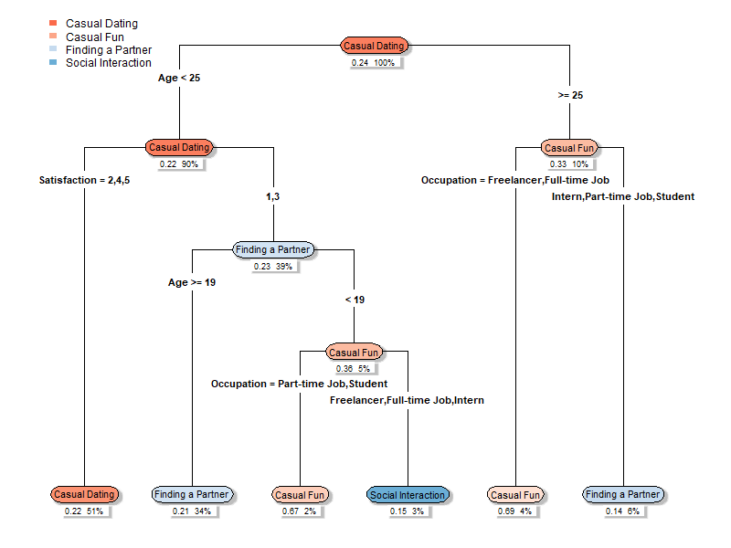

# 📱 Dating App User Behavior Analysis

This project analyzes user behavior from a dating app survey dataset to uncover motivations behind app usage. By leveraging decision tree models, it attempts to predict the **Reason for Using** the app based on demographic and usage characteristics.

---

## 🔍 Project Objectives

* Clean and preprocess survey responses
* Engineer informative features (e.g., daily usage time, binary indicators for secondary app use)
* Visualize variable relationships and usage trends
* Train decision tree models to classify users' reasons for using the app
* Evaluate model performance through accuracy metrics and confusion matrices

---

## 🗃️ Dataset Overview

**File**: `data.csv`
**Key Features**:

* Demographics: `Age`, `Gender`, `Education`, `Occupation`
* App usage: `Primary_App`, `Secondary_Apps`, `Usage_Frequency`, `Daily_Usage_Time`
* Behavioral and attitudinal: `Reason_for_Using`, `Satisfaction`, `Partner_Priorities`

---

## 🛠️ Tools & Methodology

* **Language**: R (R Markdown)
* **Libraries**:

  * `tidyverse`, `dplyr`, `ggplot2` – data cleaning and visualization
  * `rpart`, `rpart.plot` – decision tree modeling
  * `caret` – model evaluation and metrics

---

## 📊 Exploratory Data Analysis

Visualizations were used to investigate how the **Reason for Using** relates to:

* Communication style and preferences
* Educational and occupational background
* Satisfaction levels and daily app usage
* Frequency of engagement with the app

---

## 🌳 Modeling Approach

* Built classification trees using `rpart()` to predict `Reason_for_Using`
* Evaluated performance with `confusionMatrix()` and overall accuracy
* Tested multiple model configurations by adjusting features and tuning parameters such as `minsplit`
* 

---

## ❓ Why the Model Struggled

* Limited differentiation among user groups
* Sparse and categorical nature of many features
* Subjectivity in survey responses
* Small dataset and lack of continuous variables

---

## 🔮 Future Directions

To improve predictive performance:

* Increase dataset size (more users, more features)
* Collect richer, more granular data (e.g., timestamps, message patterns)
* Combine similar classes to reduce label complexity
* Apply more robust algorithms like Random Forest or XGBoost

---

## 🧠 Key Takeaways

* Modeling human behavior—especially dating motivations—is complex and imprecise
* Younger users with lower satisfaction levels may be more inclined to seek meaningful relationships
* Even with limitations, exploratory modeling provides valuable insights and direction for future analysis

